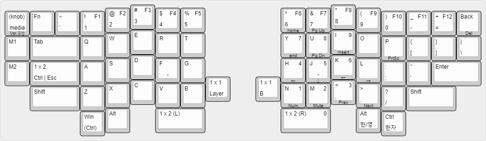

# ErgoKey

ErgoKey is $7 \times 4$ column-staggered split keyboard heavily inspired by the [Timception/Drift](https://github.com/Timception/Drift) and [kata0510/Lily58](https://github.com/kata0510/Lily58).

## Layout

